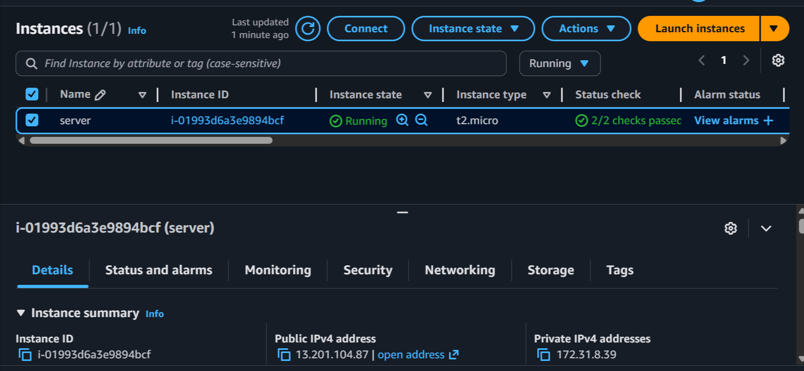
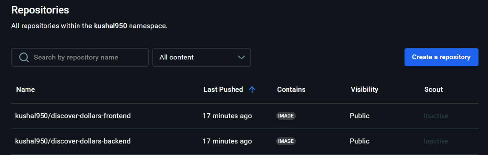
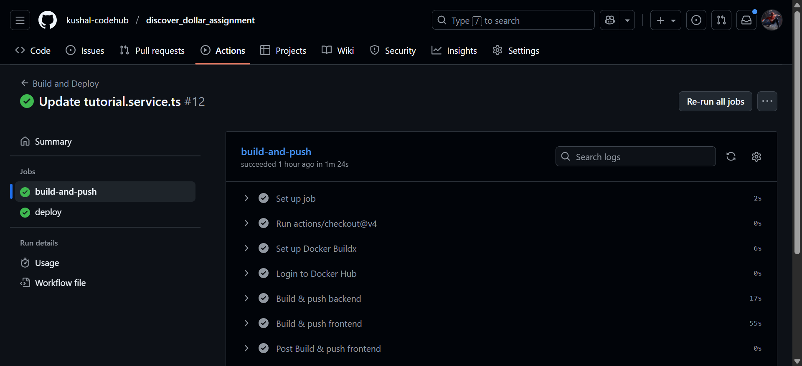
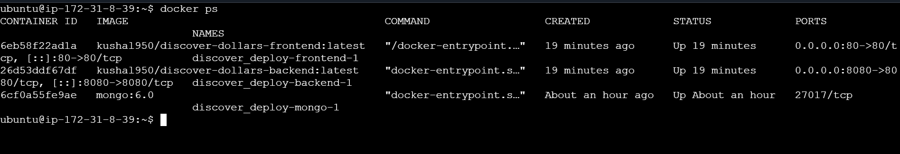
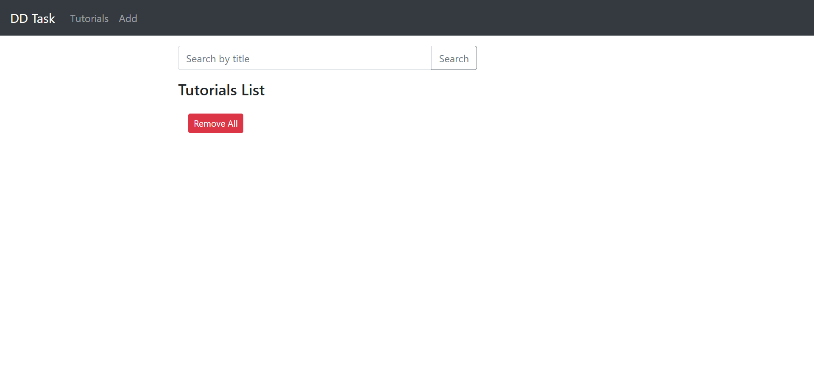
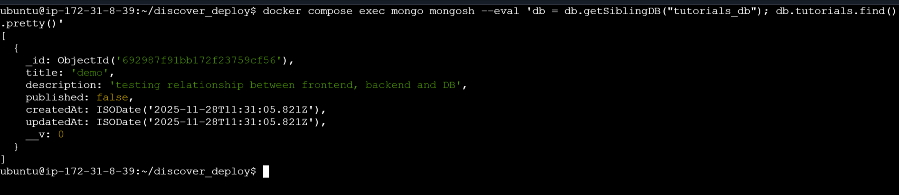

# Project Architecture Overview

Browser → Nginx (inside frontend container) → Backend API → MongoDB

The frontend container serves the Angular app using NGINX and proxies /api requests to the backend.

The backend container exposes REST APIs built in Node.js + Express.

MongoDB container stores tutorial documents.

The CI/CD pipeline builds and pushes Docker images to Docker Hub, then deploys them on EC2 through SSH automation.

## 1. Dockerization

### Backend Dockerfile (Node.js + Express)

The backend Dockerfile:

- Uses node:18-alpine for lightweight builds
- Installs dependencies using npm ci
- Copies application source
- Exposes port 8080
- Starts the server using node server.js

**Purpose:** Containerizes the Express backend and allows it to run as a service inside Docker Compose.

### Frontend Dockerfile (Angular + NGINX)

The frontend Dockerfile performs two stages:

#### 1. Build Stage

- Uses node:18-alpine
- Installs Angular dependencies
- Builds the production Angular app (ng build --configuration production)

#### 2. Runtime Stage (NGINX)

- Uses nginx:stable-alpine
- Removes default NGINX html directory
- Copies built Angular dist folder into /usr/share/nginx/html
- Copies custom nginx.conf into /etc/nginx/conf.d/default.conf

**Purpose:** The frontend is served via NGINX for high performance, and NGINX proxies /api requests to the backend container.

## 2. NGINX Reverse Proxy Setup

The nginx.conf file:
```nginx
server {
    listen 80;
    server_name _;

    root /usr/share/nginx/html;
    index index.html;

    # Angular SPA routing
    location / {
        try_files $uri $uri/ /index.html;
    }

    # Proxy API requests to backend
    location /api/ {
        proxy_pass http://backend:8080/api/;
    }
}
```

**What this does:**

- Serves Angular frontend
- Forwards /api/... requests to the backend container
- Ensures correct Single Page Application (SPA) routing

## 3. Docker Compose Setup

The docker-compose.yml defines three services:

### mongo

- Uses official mongo:6.0 image
- Stores persistent DB data in mongo_data volume

### backend

- Pulls backend image from Docker Hub
- Connects to MongoDB via MONGO_URI=mongodb://mongo:27017/tutorials_db

### frontend

- Runs NGINX container containing Angular build
- Exposes port 80 publicly

All services share the same Docker network appnet to allow container-to-container DNS resolution.

## 4. Application Code Changes

### Updated MongoDB URL

In backend db.config.js / server.js environment, updated:
```
mongodb://mongo:27017/tutorials_db
```

This ensures backend connects to MongoDB inside Docker Compose.

### Updated Angular tutorial.service.ts

Replaced hardcoded localhost:
```typescript
private baseUrl = '/api/tutorials';
```

**Why?** So Angular communicates to backend through NGINX, not localhost. This enables correct API routing on the EC2 production environment.

## 5. CI/CD – GitHub Actions Workflow

The deploy.yaml GitHub workflow automates:

### Job 1: build-and-push

- Checks out repository
- Sets up Docker Buildx
- Logs into Docker Hub
- Builds backend & frontend images
- Pushes both images to Docker Hub

### Job 2: deploy

- Uses SSH to connect to EC2 server
- Pulls latest Docker images
- Restarts containers using Docker Compose

This ensures every commit to main automatically:

- builds
- pushes
- deploys
- restarts app on EC2

## 6. AWS EC2 Deployment

We created an Ubuntu EC2 instance and installed:

- Docker
- Docker Compose
- Git
- (Optional) Removed host NGINX to avoid port conflicts

Pulled project into ~/discover_deploy

Ran:
```bash
docker compose up -d
```

The application runs at:
```
http://<EC2_PUBLIC_IP>/
```

## 7. Verifying Functionality

After deployment:

- Frontend visible on port 80
- Frontend → Backend integration verified
- Backend → MongoDB integration verified
- Application UI fully functional
- Containers running:
```bash
docker ps
```

## 8. Screenshots

### EC2 Ubuntu Machine Created


### Docker Images Built & Pushed to Docker Hub


### GitHub Actions – Workflow Build & Deploy


### Running Containers on EC2 (docker ps)


### Application UI Working


### MongoDB Contents Verified


## 9. How to Run Locally
```bash
git clone <repo>

cd backend
npm install
node server.js

cd ../frontend
npm install
ng serve --open
```

Or run with Docker:
```bash
docker compose up --build
```

## Conclusion

This project demonstrates complete DevOps lifecycle:

- Containerization
- Multi-service orchestration
- Reverse proxy routing
- CI/CD automation
- Cloud deployment
- Environment configuration

This setup can be expanded with:

- HTTPS termination
- Load balancers
- Monitoring/Logging stack
- Infrastructure-as-Code
